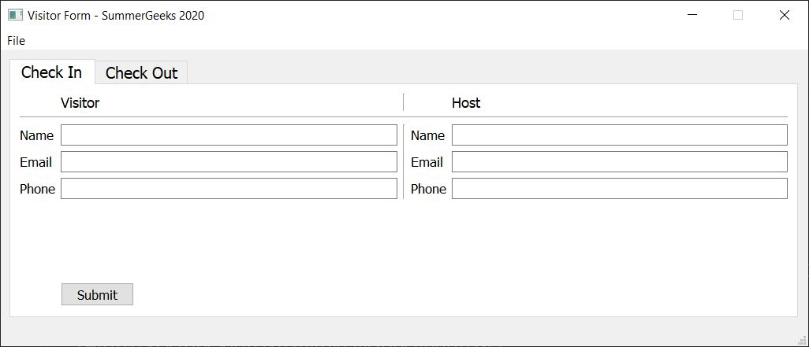
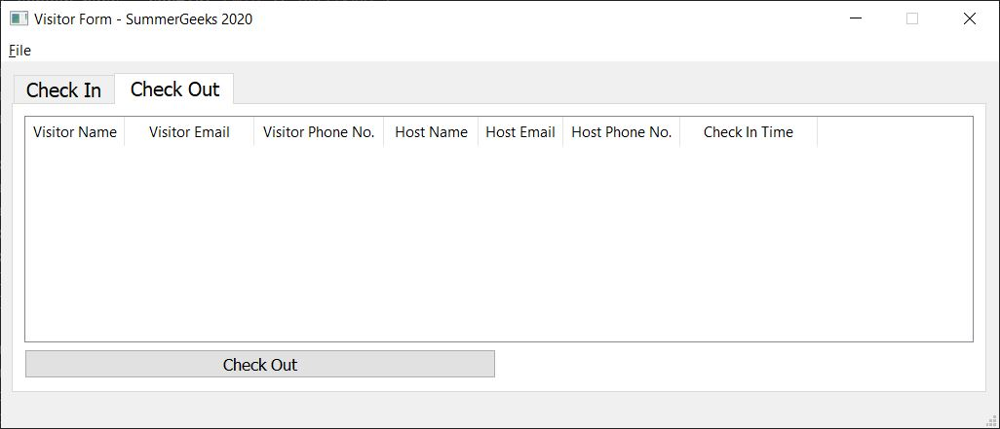

# SummerGeeks2020SDE
Innovaccer Summergeeks 2020 SDE Intern Assignment

Implemented in Python
using PYQT5 for GUI, SQLITE for Database, smtplib for Email, and way2sms API for SMS.
GUI was created with Qt Creator.

Requirements:
1. Python 3.6+
2. PyQt5 and requests (use pip install -r requirements.txt OR pip install pyqt5 requests)
3. Way2sms Account with Live API Key (Payment required)
4. Email Account (Enable less secure apps for Gmail at https://myaccount.google.com/lesssecureapps)

Installation Instructions:
1. Create way2sms Live API and Secret Key at https://www.way2sms.com/userApi
2. Create way2sms Sender ID by runing way2smsApiCreateSenderId.py
3. Enter your API key, Secret Key and Sender ID in config.ini file.
4. Enter your SMTP Server Address, Email Id and password in config.ini file.
   Visit https://serversmtp.com/smtp-server-address/ or https://domar.com/smtp_pop3_server to find your SMTP Server Address.
5. Run main.py

Usage:
1. Run MAIN.PY
2. Check-in :
   a. Select check-in tab if not selected.
   b. Fill the details.
   c. Press Submit Button.
   Details of Visitor is sent to the Host via SMS and email as provided.
   
3. Check-out :
   a. Select check-out tab if not selected.
   b. Select visitor record from table.
   c. Press Check Out Button.
   Details of the visit is sent to the Visitor to his/her email address.
   
4. Use Menu File->Exit or Close Window to exit.
